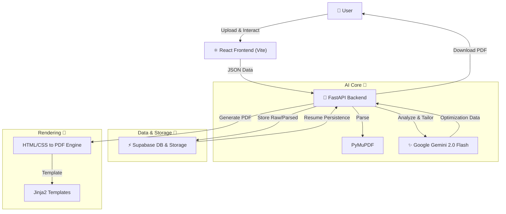

# AI Resume Builder

<div align="center">


**Stop sending generic resumes. Start landing interviews.**

An intelligent, AI-driven platform that parses your existing resume, analyzes job descriptions, and generates perfectly tailored resumes and cover letters in seconds using Google Gemini 2.0 Flash.

<br />


*Replace with actual demo/screenshot*

</div>

---

## 🏗 Technological Architecture



## 🛠 Tech Stack

### Frontend


### Backend


## 🚀 Key Features

*   **⚡️ Flash-Fast Parsing**: Instantly converts PDF resumes into structured JSON data using PyMuPDF.
*   **🤖 AI-Powered Tailoring**: Uses Google's Gemini 2.0 Flash model to rewrite experience bullets and summaries to specifically target job descriptions.
*   **🎯 Smart Gap Analysis**: Automatically detects missing skills or keywords from the JD and interviews you to fill those gaps.
*   **📄 Dynamic PDF Rendering**: Intelligent templating engine that automatically switches between Standard and Compact layouts based on content length.
*   **✍️ Auto-Cover Letter**: Generates a persuasive, role-specific cover letter matching your resume's style and tone.

## 🏁 Getting Started

### Prerequisites
*   **Node.js**: v18.0.0 or higher
*   **Python**: v3.10 or higher
*   **Supabase Account**: For database and file storage
*   **Google AI Studio Key**: For accessing Gemini models

### Installation

1.  **Clone the repository**
    ```bash
    git clone https://github.com/yourusername/ai-resume-builder.git
    cd ai-resume-builder
    ```

2.  **Backend Setup**
    ```bash
    # Create virtual environment
    python -m venv .venv
    
    # Activate (Windows)
    .venv\Scripts\activate
    # Activate (Mac/Linux)
    # source .venv/bin/activate
    
    # Install dependencies
    pip install -r requirements.txt
    ```

3.  **Frontend Setup**
    ```bash
    cd resume-builder-ui
    npm install
    ```

### Configuration

Create a `.env` file in the root directory with the following variables:

| Variable Name | Description | Required? |
| :--- | :--- | :--- |
| `SUPABASE_URL` | Your Supabase Project URL | ✅ Yes |
| `SUPABASE_KEY` | Your Supabase Service Role / Anon Key | ✅ Yes |
| `GEMINI_API_KEY` | API Key from Google AI Studio | ✅ Yes |

## 💻 Usage

1.  **Start the Backend Server**
    ```bash
    # From project root
    uvicorn main:app --reload
    ```
    *Server runs at `http://localhost:8000`*

2.  **Start the Frontend Client**
    ```bash
    # From /resume-builder-ui
    npm run dev
    ```
    *Client runs at `http://localhost:5173`*

3.  **Build Resumes!**
    *   Navigate to the frontend URL.
    *   Upload your existing PDF resume.
    *   Paste a Job Description.
    *   Let the AI perform the magic!

### 🧩 Chrome Extension Usage

The application is designed to run as a Chrome Extension, allowing you to use it alongside job boards (LinkedIn, Indeed, etc.).

1.  **Build the Extension**
    ```bash
    cd resume-builder-ui
    npm run build
    ```

2.  **Load in Chrome**
    *   Open Chrome and navigate to `chrome://extensions/`.
    *   Enable **Developer mode** (top right).
    *   Click **Load unpacked**.
    *   Select the `resume-builder-ui/dist` folder.

3.  **Open the Side Panel**
    *   Pin the extension to your toolbar.
    *   Click the extension icon to open the AI Resume Builder in the side panel while browsing job posts.


## 🗺️ Project Roadmap

- [ ] **User Authentication**: Secure individual user profiles with Supabase Auth or Auth0.
- [ ] **Multiple Profiles**: Allow users to manage multiple base resumes (e.g., "Developer" vs "Manager").
- [ ] **LinkedIn Import**: Direct integration to import profile data from LinkedIn URLs.

## 🤝 Contributing

Contributions are welcome! Please feel free to submit a Pull Request.

## 📄 License

This project is licensed under the MIT License - see the [LICENSE](LICENSE) file for details.
